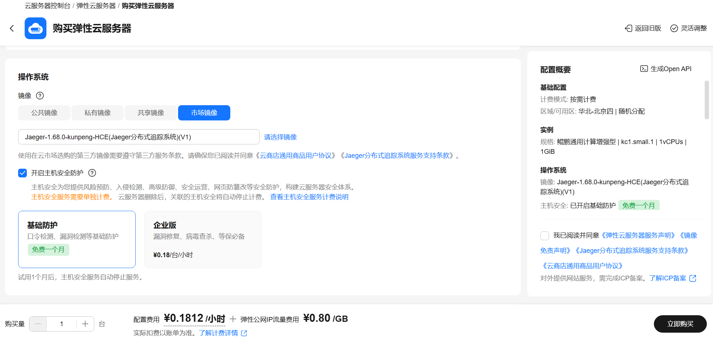
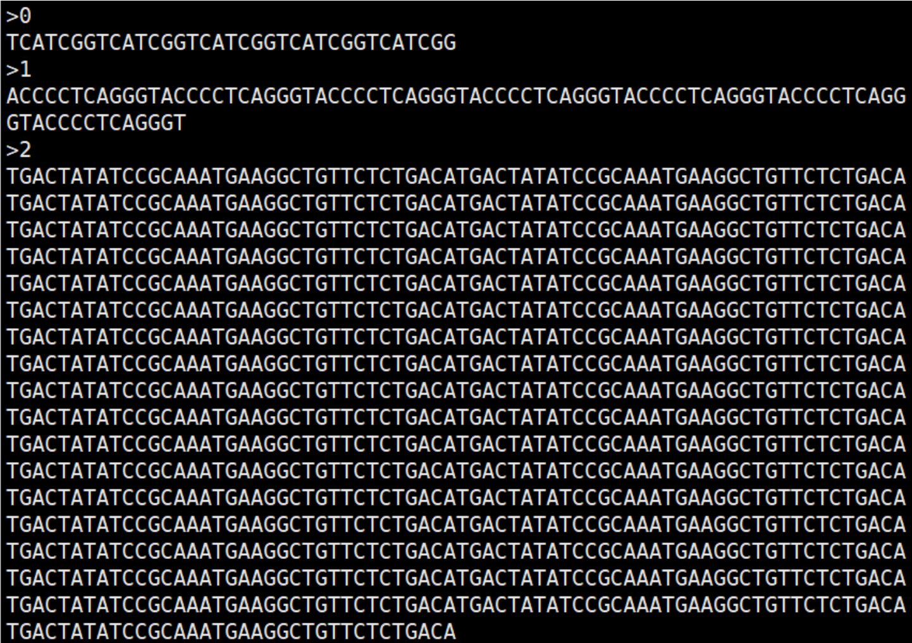
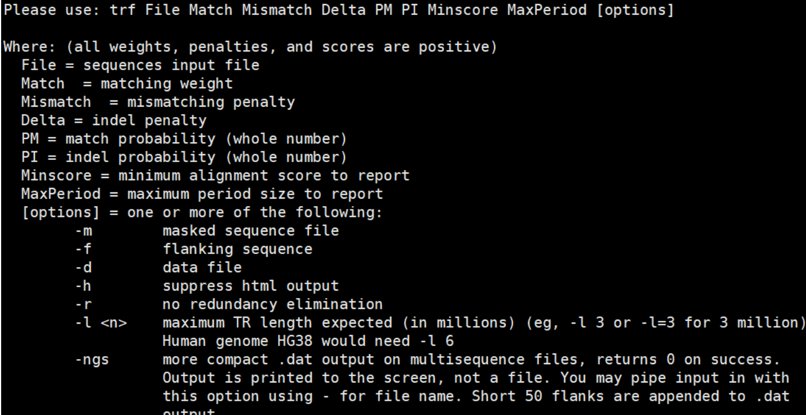
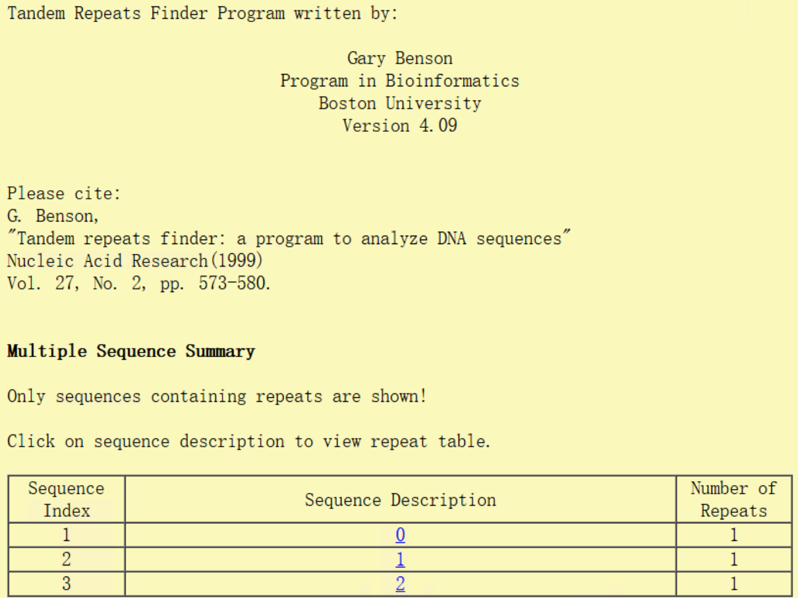

# TRF使用指南

# 一、商品链接
[TRF基因串联重复查找程序](https://marketplace.huaweicloud.com/hidden/contents/3e66a64b-fb34-4232-8176-9e0cfe66d972#productid=OFFI1172422940967157760
)
# 二、商品说明

TRF（Tandem Repeats Finder）是定位和显示 DNA 序列中串联重复序列的程序。使用该程序，您可以输入FASTA格式的序列数据，无需指定图样或其大小等其他任何参数。

本商品通过鲲鹏服务器+Huawei Cloud EulerOS 2.0 64bit系统进行安装部署。

# 三、商品购买

您可以在云商店搜索“TRF基因串联重复查找程序”找到该商品。

其中，地域、规格、推荐配置使用默认，购买方式根据您的需求选择按需/按月/按年，短期使用推荐按需，长期使用推荐按月/按年，确认配置后点击“立即购买”。

# 四、商品资源配置

本商品支持ECS控制台配置，下面对资源配置方式进行介绍。

## 4.1 ECS 控制台配置

### 准备工作

在使用ECS控制台配置前，需要您提前配置好 **安全组规则**。

> **安全组规则的配置如下：**
>
> - 入方向规则放通 CloudShell 连接实例使用的端口 `22`，以便在控制台登录调试
> - 出方向规则一键放通

### 创建ECS

前提工作准备好后，在 ECS 控制台配置跳转到[购买ECS](https://support.huaweicloud.com/qs-ecs/ecs_01_0103.html) 页面，ECS 资源的配置如下图所示：

选择CPU架构

选择服务器规格

选择镜像规格


其他参数根据实际情况进行填写，填写完成之后，点击立即购买即可


> **值得注意的是：**
>
> - VPC 您可以自行创建
> - 安全组选择 [**准备工作**](#准备工作) 中配置的安全组；
> - 弹性公网IP选择现在购买，推荐选择“按流量计费”，带宽大小可设置为5Mbit/s；
> - 高级配置需要在高级选项支持注入自定义数据，所以登录凭证不能选择“密码”，选择创建后设置；
> - 其余默认或按规则填写即可。

# 五、商品使用
DNA 中的串联重复序列是核苷酸模式的两个或多个相邻的近似拷贝。TRF是一个用于定位和显示DNA序列中串联重复序列的程序，输入为FASTA格式DNA序列文件。 
## 5.1 数据准备
将您的DNA序列数据预处理为FASTA格式，内容格式参考如下：

## 5.2 命令行使用
进入命令行，输入`trf`命令可以获得使用说明，包含各个参数的使用与含义，如下：

可以发现，TRF至少需要8个参数，并且可以通过指定选项来生成其他文件。各个参数
的详细说明可以参考官方文档[TRF](https://github.com/Benson-Genomics-Lab/TRF)。需要注意的是，输入序列的长度与查找的范围和使用的内存强相关，您可以根据实际使用需求选择合适的服务器规格。下面我们以测试数据和常用参数为例：
```
$ trf test_seqs.fasta 2 5 7 80 10 50 2000 -l 10
```
将生成一系列文件，如下所示：
```
$ ls
test_seqs.fasta.2.5.7.80.10.50.2000.summary.html
test_seqs.fasta.s1.2.5.7.80.10.50.2000.1.html
test_seqs.fasta.s1.2.5.7.80.10.50.2000.1.txt.html
test_seqs.fasta.s2.2.5.7.80.10.50.2000.1.html
test_seqs.fasta.s2.2.5.7.80.10.50.2000.1.txt.html
test_seqs.fasta.s3.2.5.7.80.10.50.2000.1.html
test_seqs.fasta.s3.2.5.7.80.10.50.2000.1.txt.html
test_seqs.fasta.s4.2.5.7.80.10.50.2000.1.html
test_seqs.fasta.s4.2.5.7.80.10.50.2000.1.txt.html
```
可以使用浏览器查看，如`test_seqs.fasta.2.5.7.80.10.50.2000.summary.html`：

## 参考文档
- [Benson-Genomics-Lab/TRF：串联重复查找器：分析 DNA 序列的程序](https://github.com/Benson-Genomics-Lab/TRF)
